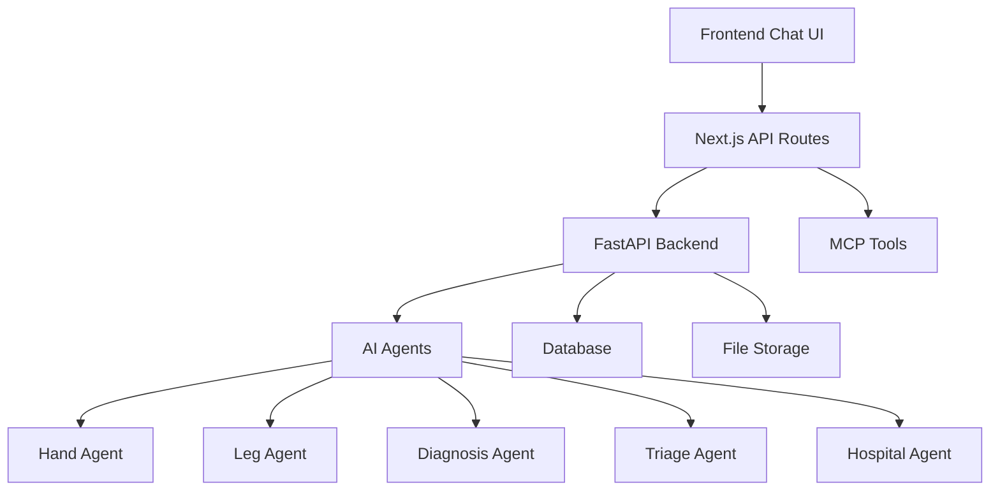

# OrthoAssist Chat System Documentation

## 📖 Table of Contents
- [Overview](#overview)
- [Architecture](#architecture)
- [API Endpoints](#api-endpoints)
- [Frontend Integration](#frontend-integration)
- [Usage Examples](#usage-examples)
- [File Upload](#file-upload)
- [MCP Integration](#mcp-integration)
- [Error Handling](#error-handling)
- [Configuration](#configuration)
- [Deployment](#deployment)

## 🎯 Overview

The OrthoAssist Chat System provides a comprehensive real-time chat interface for X-ray analysis, medical consultations, and AI-powered orthopedic assistance. It seamlessly integrates with FastAPI backend services and supports Model Context Protocol (MCP) for AI assistant interactions.

### Key Features
- 🔍 **X-ray Image Analysis** - Upload and analyze medical images
- 💬 **Real-time Chat** - Instant communication with AI assistants
- 📄 **PDF Report Generation** - Downloadable medical reports
- 🏥 **Hospital Finder** - Locate nearby specialists
- 🛠️ **MCP Integration** - AI tool execution capabilities
- 📱 **Responsive UI** - Works on all devices

## 🏗️ Architecture



### Technology Stack
- **Frontend**: Next.js 14, TypeScript, Tailwind CSS
- **Backend**: FastAPI, Python
- **UI Components**: shadcn/ui
- **State Management**: React Hooks
- **File Upload**: FormData, Base64 encoding
- **Image Processing**: Cloudinary integration

## 🔌 API Endpoints

### 1. Chat Endpoints

#### POST `/api/chat`
Send messages and receive AI responses.

**Request Body (JSON):**
```json
{
  "message": "Analyze my X-ray image",
  "image_data": "base64_encoded_image", // optional
  "chat_id": "uuid", // optional
  "user_info": {
    "name": "John Doe",
    "age": "30",
    "gender": "Male"
  },
  "mcp_context": {} // optional
}
```

**Request Body (FormData):**
```javascript
const formData = new FormData();
formData.append('message', 'Analyze this X-ray');
formData.append('image', imageFile);
formData.append('chat_id', chatId);
formData.append('user_info', JSON.stringify(userInfo));
```

**Response:**
```json
{
  "message_type": "analysis",
  "content": "🔍 **X-ray Analysis Complete**\n\nI've analyzed your X-ray...",
  "data": {
    "detections": {},
    "diagnosis": {},
    "triage": {
      "level": "AMBER",
      "confidence": 0.85,
      "recommendation": "Seek medical attention within 24-48 hours"
    }
  },
  "actions": [
    {
      "type": "generate_report",
      "label": "📄 Generate Medical Report"
    }
  ],
  "images": ["https://cloudinary.com/image1.jpg"],
  "attachments": [],
  "timestamp": "2025-09-20T10:30:00Z",
  "chat_id": "uuid"
}
```

#### GET `/api/chat?context=post_analysis`
Get contextual chat suggestions.

**Response:**
```json
{
  "suggestions": [
    "📄 Generate detailed PDF report",
    "🏥 Find specialists for this condition",
    "💊 What treatments are available?"
  ]
}
```

### 2. Session Management

#### POST `/api/chat/new`
Create a new chat session.

**Response:**
```json
{
  "chat_id": "uuid",
  "welcome_message": "👋 Welcome to OrthoAssist!",
  "suggestions": [
    "🔍 Upload X-ray for analysis",
    "💬 Describe your symptoms"
  ]
}
```

#### GET `/api/chat/{chat_id}/history`
Retrieve chat conversation history.

**Response:**
```json
{
  "chat_id": "uuid",
  "messages": [
    {
      "user_message": "Hello",
      "bot_response": "Hi! How can I help?",
      "timestamp": "2025-09-20T10:00:00Z",
      "intent": "general_conversation"
    }
  ],
  "context": {}
}
```

### 3. MCP Tool Integration

#### POST `/api/mcp/tools/{tool_name}`
Execute MCP tools for AI assistants.

**Request Body:**
```json
{
  "parameters": {
    "query": "What is a fracture?",
    "symptoms": ["pain", "swelling"],
    "body_part": "hand"
  },
  "chat_id": "uuid"
}
```

**Response:**
```json
{
  "tool_execution": {
    "tool": "orthopedic_knowledge",
    "result": {
      "query": "What is a fracture?",
      "response": "A fracture is a break in bone...",
      "confidence": 0.95
    },
    "status": "success"
  },
  "timestamp": "2025-09-20T10:30:00Z",
  "chat_id": "uuid"
}
```

### 4. Report Download

#### GET `/api/reports/{report_id}/download`
Download generated PDF reports.

**Response:**
- **Content-Type**: `application/pdf`
- **Content-Disposition**: `attachment; filename="orthoassist_report_{report_id}.pdf"`
- Binary PDF data

## 🎨 Frontend Integration

### Using the Chat Hook

```typescript
import { useChat } from '@/hooks/use-chat';

function ChatComponent() {
  const {
    messages,
    isLoading,
    error,
    sendMessage,
    sendMessageWithImage,
    startNewChat,
    clearChat
  } = useChat();

  const handleSendMessage = async () => {
    await sendMessage("Analyze my symptoms");
  };

  const handleImageUpload = async (file: File) => {
    await sendMessageWithImage("Please analyze this X-ray", file);
  };

  return (
    <div>
      {/* Chat UI implementation */}
    </div>
  );
}
```

### Using the API Client Directly

```typescript
import { OrthoAssistChatAPI } from '@/lib/api/chat';

const chatAPI = new OrthoAssistChatAPI();

// Start new chat
const { success, data } = await chatAPI.startNewChat();
if (success) {
  console.log('Chat ID:', data.chat_id);
}

// Send message
const response = await chatAPI.sendMessage("Hello");
if (response.success) {
  console.log('Bot response:', response.data.content);
}

// Upload image
const imageResponse = await chatAPI.sendMessageWithImage(
  "Analyze this X-ray", 
  imageFile
);
```

## 📤 File Upload

### Image Validation
```typescript
import { FileUtils } from '@/lib/api/chat';

const validation = FileUtils.validateImageFile(file);
if (!validation.valid) {
  console.error(validation.error);
  return;
}

// Convert to base64
const base64 = await FileUtils.fileToBase64(file);

// Create preview
const preview = FileUtils.createImagePreview(file);
```

### Supported Formats
- **Types**: JPEG, PNG, WebP
- **Max Size**: 10MB
- **Resolution**: Any (optimized for X-ray images)

## 🛠️ MCP Integration

### Available Tools

#### 1. Orthopedic Knowledge
```typescript
await chatAPI.executeMCPTool('orthopedic_knowledge', {
  query: 'What causes bone fractures?'
});
```

#### 2. Symptom Analysis
```typescript
await chatAPI.executeMCPTool('symptom_analysis', {
  symptoms: ['pain', 'swelling', 'bruising'],
  body_part: 'wrist'
});
```

#### 3. Treatment Recommendations
```typescript
await chatAPI.executeMCPTool('treatment_recommendations', {
  condition: 'hairline fracture'
});
```

## ❌ Error Handling

### API Response Format
```typescript
type ApiResponse<T> = {
  success: true;
  data: T;
} | {
  success: false;
  error: {
    error: string;
    details?: string;
    timestamp: string;
    code?: string;
  };
};
```

### Error Types and Handling
```typescript
import { ErrorUtils } from '@/lib/api/chat';

// Check error type
if (ErrorUtils.isNetworkError(error)) {
  // Handle network issues
}

// Get user-friendly message
const message = ErrorUtils.getUserFriendlyMessage(error);
```

### Common Error Scenarios
- **Network Errors**: Connection issues with FastAPI backend
- **File Upload Errors**: Invalid file format or size
- **Session Errors**: Invalid or expired chat sessions
- **Server Errors**: Internal FastAPI processing errors

## ⚙️ Configuration

### Environment Variables

Create `.env.local`:
```env
# FastAPI Backend URL
FASTAPI_BASE_URL=http://localhost:8000

# App Configuration
NEXT_PUBLIC_APP_NAME=OrthoAssist
NEXT_PUBLIC_APP_VERSION=1.0.0

# File Upload Limits
NEXT_PUBLIC_MAX_FILE_SIZE_MB=10
NEXT_PUBLIC_SUPPORTED_IMAGE_TYPES=image/jpeg,image/jpg,image/png,image/webp

# Chat Configuration
NEXT_PUBLIC_MAX_CHAT_HISTORY=50
NEXT_PUBLIC_CHAT_TIMEOUT_MS=30000
```

### FastAPI Backend Setup
Ensure your FastAPI backend has these endpoints:
- `POST /api/chat`
- `POST /api/chat/new`
- `GET /api/chat/{chat_id}/history`
- `POST /api/mcp/tools/{tool_name}`
- `GET /api/reports/{report_id}/download`

## 🚀 Deployment

### Development
```bash
# Install dependencies
npm install

# Set environment variables
cp .env.example .env.local

# Start development server
npm run dev
```

### Production
```bash
# Build application
npm run build

# Start production server
npm start
```

### Docker Deployment
```dockerfile
FROM node:18-alpine
WORKDIR /app
COPY package*.json ./
RUN npm ci --only=production
COPY . .
RUN npm run build
EXPOSE 3000
CMD ["npm", "start"]
```

## 📊 Message Flow Examples

### 1. Simple Text Conversation
```
User: "What is a fracture?"
Bot: "A fracture is a break in the continuity of bone..."
```

### 2. X-ray Analysis Workflow
```
User: [Uploads X-ray image] "Please analyze this"
Bot: "🔍 X-ray Analysis Complete
     • Finding: Possible hairline fracture
     • Confidence: 85%
     • Triage: AMBER"
Actions: [Generate Report] [Find Hospitals] [Second Opinion]
```

### 3. Report Generation
```
User: [Clicks "Generate Report"]
Bot: "📄 Medical Report Generated Successfully
     Your comprehensive report is ready for download."
Attachment: orthoassist_report_12345678.pdf
```

### 4. MCP Tool Usage
```
AI Assistant: "I need to analyze symptoms"
System: [Executes symptom_analysis tool]
AI Assistant: "Based on the symptoms analysis..."
```

## 🔐 Security Considerations

### File Upload Security
- File type validation
- Size limitations
- Virus scanning (recommended)
- Secure file storage

### API Security
- Rate limiting
- Input validation
- CORS configuration
- Authentication (if required)

### Data Privacy
- No persistent storage of sensitive data
- Secure transmission (HTTPS)
- Compliance with medical data regulations

## 📈 Monitoring and Analytics

### Performance Metrics
- Response times
- Error rates
- File upload success rates
- User engagement

### Logging
```typescript
// Example logging in API routes
console.log('Chat request:', {
  chatId,
  messageType: request.message ? 'text' : 'image',
  timestamp: new Date().toISOString()
});
```

## 🤝 Contributing

### Development Workflow
1. Create feature branch
2. Implement changes
3. Add tests
4. Update documentation
5. Create pull request

### Code Style
- Use TypeScript
- Follow ESLint rules
- Add proper type definitions
- Include error handling

---

## 📝 Changelog

### v1.0.0 (2025-09-20)
- Initial chat system implementation
- X-ray analysis integration
- MCP tool support
- PDF report generation
- Comprehensive error handling

---

*For support and questions, please refer to the project repository or contact the development team.*